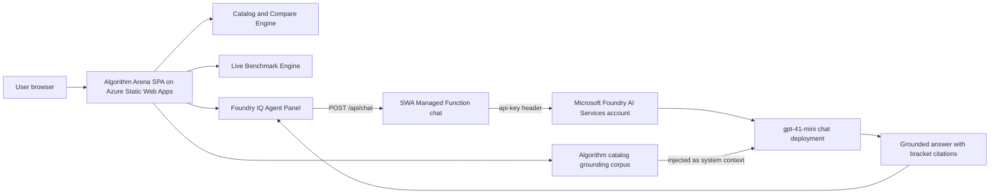

# Algorithm Arena

Algorithm Arena compares computer-science algorithms across complexity, speed, memory, CPU behavior, architecture fit (ARM vs x86-64), usability, gaming fit, and simulation fit.

It also includes a live benchmark engine and a Foundry IQ Agent panel for grounded recommendations with citations.

**Live demo:** https://happy-island-0e196290f.7.azurestaticapps.net/

No sign-in, no token paste — the Foundry IQ Agent tab works out of the box against a hosted Microsoft Foundry chat deployment via a Static Web Apps managed Function relay.

## Challenge Alignment (Agents League)

Track target: Creative Apps (GitHub Copilot) with Microsoft IQ integration via Foundry IQ.

This project includes:
- A working, demoable app
- Foundry IQ integration path (Foundry IQ Agent tab)
- Public source code
- Submission checklist and architecture diagram

## Features

- Catalog view with 20+ algorithms across categories
- Side-by-side comparison matrix for strengths/weaknesses and technical traits
- Live browser benchmarking for benchmarkable algorithms
- Black glassmorphism interface
- Foundry IQ Agent tab for grounded, cited recommendations

## Architecture



The browser never sees a Foundry token or key. The SWA-hosted Function in
[`api/src/functions/chat.ts`](api/src/functions/chat.ts) attaches the
Foundry account API key server-side and forwards to the chat-completions
endpoint.

## Local Run

1. Install dependencies:

```bash
npm install
```

2. Start development server:

```bash
npm run dev
```

3. Open the printed local URL (default: http://localhost:5173).

## Foundry IQ Setup

The Foundry IQ Agent tab calls a Foundry-hosted chat deployment via the
Azure OpenAI-compatible data plane. Algorithm Arena’s own algorithm catalog
is injected into the system prompt as a grounding corpus, and the model is
instructed to cite with `[n]` indices that map to entries in that corpus.

The Agent tab supports three auth modes:

- `relay` (default in production) — calls `/api/chat` on the same origin.
  No token in the browser. Used by the public hosted demo.
- `bearer` — paste a short-lived Azure AD bearer token. Used for local dev
  through the Vite proxy at `/foundry`.
- `api-key` — paste the Foundry account key. Convenient for one-off testing
  only; never expose this in a shipped frontend.

Defaults are read from `.env` (copy `.env.example` to `.env`) and can be
overridden in the UI form at runtime.

### Current Provisioned Azure Resources

- Resource group: `rg-algorithm-arena`
- Foundry account: `ai-account-skldjimkph5a6` (kind=AIServices, S0, northcentralus)
- Foundry project: `ai-project-algorithm-arena`
- Chat deployment: `gpt-41-mini` (model `gpt-4.1-mini` @ `2025-04-14`, GlobalStandard)
- Azure OpenAI base: `https://ai-account-skldjimkph5a6.cognitiveservices.azure.com`
- Static Web App: `algorithm-arena-web` (Standard, eastus2)
- Hosted URL: https://happy-island-0e196290f.7.azurestaticapps.net/
- SWA-managed Function: `POST /api/chat` (relay; reads `FOUNDRY_*` app settings)

Infra is defined in [`infra/swa.bicep`](infra/swa.bicep) and deploys via the
`Deploy Static Web App` GitHub Actions workflow in
[`.github/workflows/deploy-swa.yml`](.github/workflows/deploy-swa.yml).

### Quick Bearer Token Flow (local dev only)

1. Get a fresh bearer token (expires in ~1 hour):

```powershell
powershell -ExecutionPolicy Bypass -File .\scripts\get-foundry-token.ps1
```

2. In the app Foundry IQ Agent tab:

- Auth mode: `bearer`
- Endpoint URL: `/foundry` (dev proxy) or your prod relay base
- Deployment: `gpt-41-mini`
- API version: `2025-01-01-preview`
- Token: paste the script output

3. Ask a question. The model is grounded to the catalog and will end with a
   `Citations: [n], [m]` line; the UI maps those indices to algorithm entries.

4. If the token expires, run the script again and paste a fresh one.

4. If the token expires, run the script again and paste a fresh one.

## Submission Checklist

- [x] Register for Agents League
- [ ] Select your challenge track (Creative Apps with GitHub Copilot)
- [x] Foundry IQ integration working end-to-end against `gpt-41-mini` deployment with grounded catalog + indexed citations
- [x] Public hosted demo with tokenless Foundry calls: https://happy-island-0e196290f.7.azurestaticapps.net/
- [ ] Record demo video (max 5 minutes)
- [x] Public repository: https://github.com/adekeji/Algorithm
- [x] README updated with architecture, setup, and provisioned resources
- [x] Architecture diagram included
- [x] No credentials or secrets committed (`.env` is gitignored, only `.env.example` is tracked)
- [ ] Submit project description + video + repo + diagram in contest portal

## Security Notes

- Never commit API keys, tokens, or secrets.
- This project intentionally keeps token entry runtime-only in the UI.
- Use a backend relay in production if you need stronger key protection.

## Tech Stack

- React 19
- TypeScript
- Vite
- Tailwind CSS v4
- Recharts
