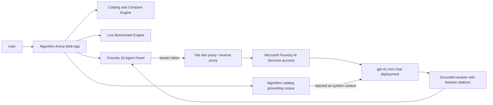

# Algorithm Arena

Algorithm Arena compares computer-science algorithms across complexity, speed, memory, CPU behavior, architecture fit (ARM vs x86-64), usability, gaming fit, and simulation fit.

It also includes a live benchmark engine and a Foundry IQ Agent panel for grounded recommendations with citations.

## Challenge Alignment (Agents League)

Track target: Creative Apps (GitHub Copilot) with Microsoft IQ integration via Foundry IQ.

This project includes:
- A working, demoable app
- Foundry IQ integration path (Foundry IQ Agent tab)
- Public source code
- Submission checklist and architecture diagram

## Features

- Catalog view with 20+ algorithms across categories
- Side-by-side comparison matrix for strengths/weaknesses and technical traits
- Live browser benchmarking for benchmarkable algorithms
- Black glassmorphism interface
- Foundry IQ Agent tab for grounded, cited recommendations

## Architecture



## Local Run

1. Install dependencies:

```bash
npm install
```

2. Start development server:

```bash
npm run dev
```

3. Open the printed local URL (default: http://localhost:5173).

## Foundry IQ Setup

The Foundry IQ Agent tab calls a Foundry-hosted chat deployment via the
Azure OpenAI-compatible data plane. Algorithm Arena’s own algorithm catalog
is injected into the system prompt as a grounding corpus, and the model is
instructed to cite with `[n]` indices that map to entries in that corpus.

Defaults are read from `.env` (copy `.env.example` to `.env`) and can be
overridden in the UI form at runtime.

In **dev**, set `VITE_FOUNDRY_IQ_ENDPOINT_URL=/foundry` so the browser hits
the Vite proxy (defined in `vite.config.ts`), which forwards to the Foundry
account and bypasses CORS. In **prod**, point this at your own reverse proxy
(e.g. an Azure Function or App Service) that injects the bearer token
server-side — never ship long-lived secrets to the browser.

### Current Provisioned Azure Foundry Resources

- Resource group: `rg-algorithm-arena` (northcentralus)
- Foundry account: `ai-account-skldjimkph5a6` (kind=AIServices, S0)
- Foundry project: `ai-project-algorithm-arena`
- Chat deployment: `gpt-41-mini` (model `gpt-4.1-mini` @ `2025-04-14`, GlobalStandard)
- Azure OpenAI base: `https://ai-account-skldjimkph5a6.cognitiveservices.azure.com`
- Local key auth is disabled (`disableLocalAuth=true`) → bearer mode only
- Required data-plane roles on the account: `Cognitive Services OpenAI User`
  and `Cognitive Services User` (already assigned to the deploying user)

Hosted capability host (Foundry Agents service) failed during `azd provision`
with a VNet configuration error. This blocks the hosted-Agent path but does
not affect this app, which uses the chat-completions deployment directly.

### Quick Bearer Token Flow

1. Get a fresh bearer token (expires in ~1 hour):

```powershell
powershell -ExecutionPolicy Bypass -File .\scripts\get-foundry-token.ps1
```

2. In the app Foundry IQ Agent tab:

- Auth mode: `bearer`
- Endpoint URL: `/foundry` (dev proxy) or your prod relay base
- Deployment: `gpt-41-mini`
- API version: `2025-01-01-preview`
- Token: paste the script output

3. Ask a question. The model is grounded to the catalog and will end with a
   `Citations: [n], [m]` line; the UI maps those indices to algorithm entries.

4. If the token expires, run the script again and paste a fresh one.

## Submission Checklist

- [x] Register for Agents League
- [ ] Select your challenge track (Creative Apps with GitHub Copilot)
- [x] Foundry IQ integration working end-to-end against `gpt-41-mini` deployment with grounded catalog + indexed citations
- [ ] Record demo video (max 5 minutes)
- [x] Public repository: https://github.com/adekeji/Algorithm
- [x] README updated with architecture, setup, and provisioned resources
- [x] Architecture diagram included
- [x] No credentials or secrets committed (`.env` is gitignored, only `.env.example` is tracked)
- [ ] Submit project description + video + repo + diagram in contest portal

## Security Notes

- Never commit API keys, tokens, or secrets.
- This project intentionally keeps token entry runtime-only in the UI.
- Use a backend relay in production if you need stronger key protection.

## Tech Stack

- React 19
- TypeScript
- Vite
- Tailwind CSS v4
- Recharts
