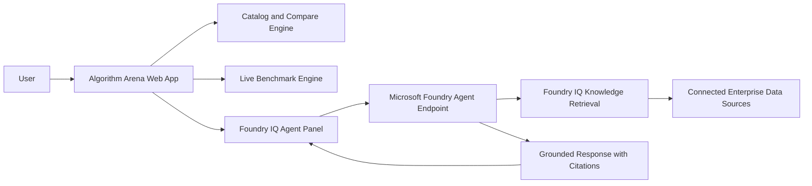

# Algorithm Arena

Algorithm Arena compares computer-science algorithms across complexity, speed, memory, CPU behavior, architecture fit (ARM vs x86-64), usability, gaming fit, and simulation fit.

It also includes a live benchmark engine and a Foundry IQ Agent panel for grounded recommendations with citations.

## Challenge Alignment (Agents League)

Track target: Creative Apps (GitHub Copilot) with Microsoft IQ integration via Foundry IQ.

This project includes:
- A working, demoable app
- Foundry IQ integration path (Foundry IQ Agent tab)
- Public source code
- Submission checklist and architecture diagram

## Features

- Catalog view with 20+ algorithms across categories
- Side-by-side comparison matrix for strengths/weaknesses and technical traits
- Live browser benchmarking for benchmarkable algorithms
- Black glassmorphism interface
- Foundry IQ Agent tab for grounded, cited recommendations

## Architecture



## Local Run

1. Install dependencies:

```bash
npm install
```

2. Start development server:

```bash
npm run dev
```

3. Open the printed local URL (default: http://localhost:5173).

## Foundry IQ Setup

The Foundry IQ Agent tab expects your endpoint details at runtime.

Option A: set defaults in `.env` from `.env.example`.

Option B: paste endpoint and token directly in the UI form.

Recommended: use a Foundry Agent endpoint configured with Foundry IQ knowledge retrieval, so answers include citations to grounded sources.

### Current Provisioned Azure Foundry Resources

Provisioning status in this repo:

- Resource group: rg-algorithm-arena
- Foundry account: ai-account-skldjimkph5a6
- Foundry project: ai-project-algorithm-arena
- Project API endpoint:
  https://ai-account-skldjimkph5a6.services.ai.azure.com/api/projects/ai-project-algorithm-arena

Notes:

- Core project resources were created successfully.
- Hosted capability host failed due VNet configuration; this does not block project-level API usage.
- Local key auth is disabled on this account, so use bearer token auth in the app.

### Quick Bearer Token Flow (for testing)

1. Run:

```powershell
powershell -ExecutionPolicy Bypass -File .\scripts\get-foundry-token.ps1
```

2. In the app Foundry IQ Agent tab:

- Auth mode: bearer
- Endpoint URL: your Foundry agent invoke endpoint (or project endpoint while validating)
- API version: 2025-05-01-preview
- Token: paste the command output

3. If token expires, run the script again and paste a fresh token.

## Submission Checklist

- [ ] Register for Agents League
- [ ] Select your challenge track
- [ ] Ensure Foundry IQ integration is working in demo
- [ ] Record demo video (max 5 minutes)
- [ ] Keep repository public
- [ ] Keep README updated
- [ ] Include architecture diagram
- [ ] Ensure no credentials/secrets are committed
- [ ] Submit project description + video + repo + diagram in contest portal

## Security Notes

- Never commit API keys, tokens, or secrets.
- This project intentionally keeps token entry runtime-only in the UI.
- Use a backend relay in production if you need stronger key protection.

## Tech Stack

- React 19
- TypeScript
- Vite
- Tailwind CSS v4
- Recharts
